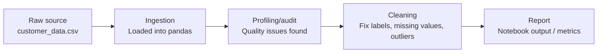

# Task 3 — Data Lifecycle & Lineage Documentation

## 1. Data Sources

| Source | What it is | Update frequency |
|---|---|---|
| `customer_data.csv` | Customer dataset used for this project | Static, one-time snapshot |

For this practice project I'm using a single CSV file as my source. In a real company setup there would usually be multiple sources (CRM, transactions, support tickets) updating at different frequencies, but here everything starts from this one file.

---

## 2. Data Lineage Diagram



The flow: raw CSV → loaded into a pandas DataFrame → profiled for quality issues (Task 2) → cleaned based on what the audit found → final metrics calculated and reported.

---

## 3. Source of Truth per Key Metric

| Metric | Source of truth | Notes |
|---|---|---|
| Total customer count | Row count of `customer_data.csv` after removing exact duplicates | Raw row count (505) includes 5 exact duplicate rows found during profiling |
| Average income | `income` column, after excluding nulls and the placeholder value (~10,000,000) | Raw mean is way off because of that one outlier |
| Customers by city | `city` column, after merging duplicate spellings (Bangalore/Bengaluru, Delhi/delhi, "Mumbai " with extra space) | Raw counts show 10 city labels instead of the actual 7 cities |
| Average age | `age` column, after excluding outlier values (negative ages, ages like 200) | A few rows have impossible values from data entry errors |

---

## 4. Transformation Stages & Ownership

| Stage | Transformation | Owner |
|---|---|---|
| Ingestion | CSV loaded into a pandas DataFrame | Me |
| Profiling | `.info()`, `.describe()`, missing-value checks, duplicate checks, category value counts | Me |
| Cleaning | Standardizing labels, handling missing values, fixing outliers/placeholders | Me |
| Reporting | Final metrics calculated from cleaned data | Me |

Right now I'm handling every stage myself since this is a solo practice project. In a real team, these stages would usually be split — e.g. Data Engineering handles ingestion, Analytics handles cleaning, and the Analyst/BI team handles reporting.

---

## 5. Retention & Privacy

- This dataset is synthetic, so there's no real personal data and no privacy rules apply here.
- If this were real customer data, I'd need to think about:
  - How long records are kept before being deleted or archived
  - Who's allowed to access the data
  - Whether personal fields (name, contact info) need to be masked before sharing

---

## 6. Tracing One Metric End-to-End — Average Income

```python
# raw value, before any fixes
raw_income = df['income']
print("Raw mean:", raw_income.mean())

# after applying the fixes from my Task 2 audit
clean_income = df[df['income'] < 1000000]['income'].dropna()
print("Clean mean:", clean_income.mean())
```
When I ran this, the raw mean came out to ₹124,280.97 — clearly wrong, since it's pulled up by the placeholder value. After removing nulls and the placeholder, the clean mean came out to ₹57,251.21, which is less than half the raw number. That's the one I'd actually report.
This traces average income from the raw CSV, through ingestion, through the issues I found during profiling (missing values + one huge placeholder value), to the corrected number that should actually be used in any report. The clean mean is the one I'd trust.
